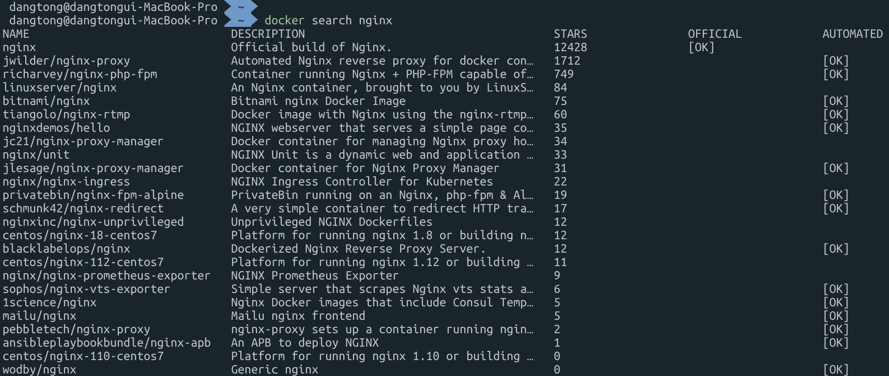
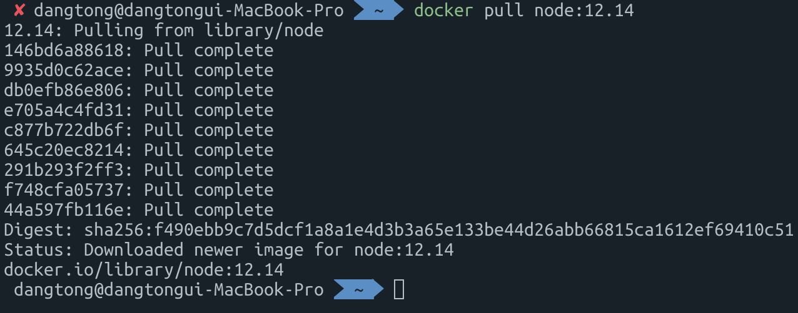
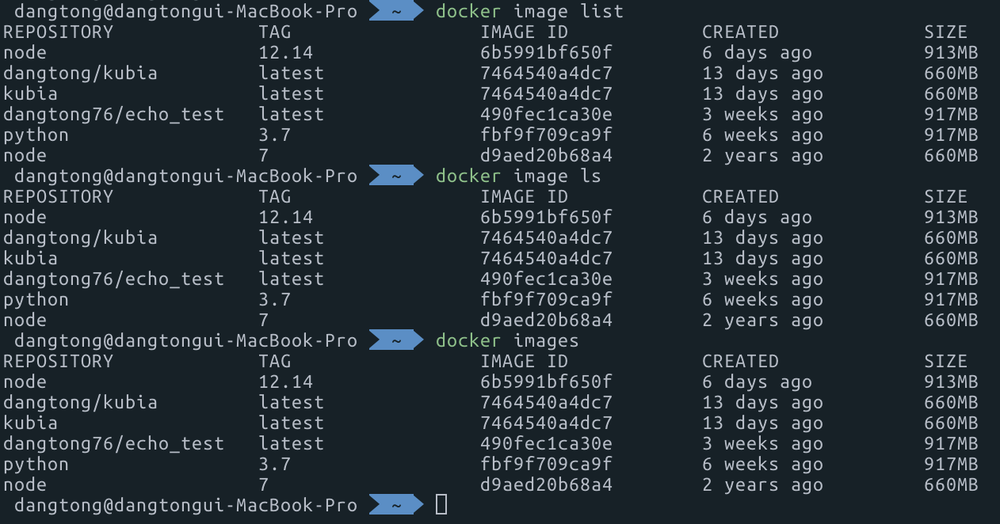
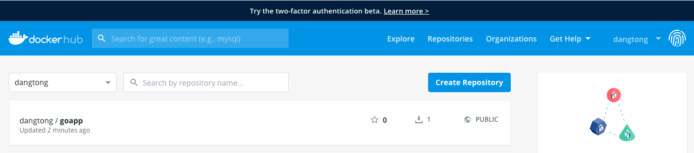

# 도커 실습하기

[toc]

## 1. 도커 이미지 조회

### 1.1 도커 이미지 검색

search 명령으로 nginx 를 검색해 봅니다.

```{bash}
sudo docker search nginx
```



> sudo 를 매번 사용하지 않고 싶으면 사용자 계정을 Docker 그룹에 추가 해주면 됩니다.
>
> ```{bash} 
> sudo usermod -aG docker kubeadmin
> ```

### 1.2 도커 이미지 다운로드

nginx 이미지를 설치해봅니다. 최신 안정버전인 1.18.0 버전을 설치 합니다.

```{bash}
sudo docker pull nginx:latest    # 최신버전 다운로드
sudo docker pull nginx:1.18.0   # 특정버전 다운로드
sudo docker pull -a nginx        # 모든버전 다운로드
```



### 1.3 도커 이미지 목록 보기

```{bash}
docker image list
docker image ls
docker images
```



### 1.4 도커 이미지 삭제

```{bash}
# 도커 이미지 삭제
docker rmi [image_id]
# 컨데이터가 존재 할경우에 함께 강제 삭제
docker rmi -f [image_id]
```

## 2. 도커 컨테이너 실행하기

```{bash}
# 컨테이너 실행 
docker run --name centos1 centos:latest /bin/bash
# -it 인터렉티브 터미널 연결하여 컨테이너 실행
docker run --name centos2 -it centos:latest /bin/bash
$ exit
# -d cmd를 백그라운드로 실행
docker run --name centos3 -d centos:latest /bin/bash
# -it 인터렉티브 연결과 -d cmd를 백그라운드로 실행
docker run --name centos4 -it -d centos:latest /bin/bash
# 실행중인 컨테이너 조회
docker ps -a
```

## 3. 컨테이너 접속

```{bash}
# 실행중인 컨테이너에 명령어 전달
docker exec centos4 whoami
# -it 인터렉티브 옵션으로 /bin/bash 실행
docker exec -it centos4 /bin/bash
$ exit
# 실행중인 컨테이너 확인
docker ps -a
# 실행중인 컨테이너 cmd에 직접 연결
$ exit
# 실행중인 컨테이너 조회
docker ps -a
```

## 4. 컨테이너 컨트롤

```{bash}
# 컨테이너 상세 정보 보기
docker inspect centos4
# 컨테이너 시작
docker start centos4
# 컨테이너 정지
docker stop centos4
# 컨테이너 삭제
docker rm centos4
# 컨테이너 조회
docker ps -a
```

## 5. 컨테이너 메뉴얼 변경 및 커밋

```{bash}
# 컨테이너 실행
docker run --name centos5 -it -d centos:latest
# 컨테이너 접속
docker exec -it centos5 /bin/bash
$ echo "testfile updated" > testfile.txt
$ exit
# 컨테이너 커밋
docker commit -a chungsju@gmail.com -m "add testfile.txt" centos5 centos-modi:0.1
# 커밋된 이미지 조회
docker images centos-modi
# 컨테이너 이미지 삭제
docker rmi centos-modi:0.1
```

## 6. 컨테이너 네트워크 조회

```{bash}
# 네트워크 조회
docker network ls
# 네트워크 상세 정보
docker inspect bridge
# 신규 브리지 네트워크 생성
docker network create --driver bridge mybridge
# 네트워크 조회
docker network ls
docker inspect mybridge
# 신규 네트워크를 사용하는 컨테이너 실행
docker run --net mybridge --name centos6 -it -d centos
docker inspect centos6 | grep NetworkMode #윈도우의 경우 grep 대신 find 명령어
# 컨테이너 정지 없이 삭제
docker rm -f centos6
#
```

## 7. 도커 이미지 생성 하기

### 7.1 서비스를 위한 Application 코드 작성

hostname_finder 라는 폴더를 만들고 그 아래 main.go 및 Dockerfiles 2개 파일을 작성 합니다.

먼저 vi 또는 gedit 를 실행해서 아래 파일을 main.go 라는 이름 으로 작성 합니다.

```{go}
package main

import (
	"fmt"
	"os"
	"log"
	"net/http"
)
func handler(w http.ResponseWriter, r *http.Request){
	name, err := os.Hostname()
	if err != nil {
		panic(err)
	}

	fmt.Fprintln(w,"hostname:", name)
}
func main() {
  fmt.Fprintln(os.Stdout,"Starting GoApp Server......")
	http.HandleFunc("/",handler)
	log.Fatal(http.ListenAndServe(":8080",nil))
}
```

### 7.2 이미지 생성을 위한 Dockerfile 작성

```{dockerfile}
FROM golang:1.11-alpine AS build

WORKDIR /src/
COPY main.go go.* /src/
RUN CGO_ENABLED=0 go build -o /bin/demo

FROM scratch
COPY --from=build /bin/demo /bin/demo
CMD ["/bin/demo"]
```

### 7.3 컨테이너 이미지 생성

hostname_finder 폴더 안에서 아래 명령어를 실행 합니다.

```{bash}
sudo docker build -t goapp .
```

> . 은 현재 디렉토리서 Dockerfile 참조해서 first-container 라는 이미지를 생성 합니다.

[출력]

```{text}
Sending build context to Docker daemon  3.072kB
Step 1/7 : FROM golang:1.11-alpine AS build
 ---> e116d2efa2ab
Step 2/7 : WORKDIR /src/
 ---> Using cachedocker
 ---> c3210d8eb11f
Step 3/7 : COPY main.go go.* /src/
 ---> ef55118ea78c
Step 4/7 : RUN CGO_ENABLED=0 go build -o /bin/demo
 ---> Running in e557730bf11c
Removing intermediate container e557730bf11c
 ---> d55bd9bd3f81
Step 5/7 : FROM scratch
 --->
Step 6/7 : COPY --from=build /bin/demo /bin/demo
 ---> bb4b1250a05e
Step 7/7 : ENTRYPOINT ["/bin/demo"]
 ---> Running in 4419d56988aa
Removing intermediate container 4419d56988aa
 ---> 36f5c919e3b8
Successfully built 36f5c919e3b8
Successfully tagged goapp:latest
```

이미지가 생성 되었는지 명령어를 통해 확인 합니다.

```{bash}
docker images
```

[출력]

```{txt}
REPOSITORY                           TAG                 IMAGE ID            CREATED              SIZE
<none>                               <none>              d55bd9bd3f81        About a minute ago   325MB
goapp                              latest              36f5c919e3b8        About a minute ago   6.51MB
<none>                               <none>              1c688e9c7e3c        3 days ago           325MB
<none>                               <none>              9b60c66a5b82        3 days ago           6.51MB
<none>                               <none>              7fc44021a96f        3 days ago           325MB
<none>                               <none>              2caa0c2ac791        3 days ago           325MB
<none>                               <none>              c46d81105b65        3 days ago           6.51MB
<none>                               <none>              2d78705fb4ae        3 days ago           312MB
```


### 7.4 도커 컨테이너 시작

```{bash}
docker run --name goapp-project -p 8080:8080 -d goapp
docker run -it --name goapp-project -p 8080:8080 -d goapp /bin/bash
```

> --name : 실행한 도커 컨테이너의 이름 지정
>
> -p : 포트 맵핑 정보 localhost 와 컨테이너 포트를 맵핑 합니다.
>
> -d : Docker 컨테이너를 백그라운드로 수행하고 컨테이너 ID를 출력 합니다.
>
> -i : STDIN 계속 interactive 모드로 유지

### 7.5 도커 컨테이스 서비스 확인

curl 명령어를 통해 정상적인 서비스 수행 여부를 확인 합니다.

```{bash}
curl localhost:8080
```

[출력]

```{txt}
hostname: 96fc3a5eb914
```

### 7.6 도커 프로세서 확인

```{bash}
docker ps
```

**[출력]**

```{txt}
CONTAINER ID        IMAGE                   COMMAND                  CREATED             STATUS              PORTS                    NAMES
96fc3a5eb914        goapp                   "/bin/demo"              43 seconds ago      Up 42 seconds       0.0.0.0:8080->8080/tcp   goapp-project
```

### 7.7 프로세서 상세 정보 출력

```{bash}
docker inspect goapp-project
```

[출력]

```{txt}
[
    {
        "Id": "96fc3a5eb914c58ed83e088681d53a46188edeaab061ff2de0b9852e9dd276c9",
        "Created": "2020-01-10T04:32:12.269012485Z",
        "Path": "/bin/demo",
        "Args": [],
        "State": {
            "Status": "running",
            "Running": true,
            "Paused": false,
            "Restarting": false,
            "OOMKilled": false,
            "Dead": false,
            "Pid": 31285,
            "ExitCode": 0,
            "Error": "",
            "StartedAt": "2020-01-10T04:32:12.902395362Z",
            "FinishedAt": "0001-01-01T00:00:00Z"
        },
        "Image": "sha256:36f5c919e3b88f1c991eda67d96e62fe02b763182e44f19fb78b2fc055165f3d",
        "ResolvConfPath": "/var/lib/docker/containers/96fc3a5eb914c58ed83e088681d53a46188edeaab061ff2de0b9852e9dd276c9/resolv.conf",
        "HostnamePath": "/var/lib/docker/containers/96fc3a5eb914c58ed83e088681d53a46188edeaab061ff2de0b9852e9dd276c9/hostname",
        "HostsPath": "/var/lib/docker/containers/96fc3a5eb914c58ed83e088681d53a46188edeaab061ff2de0b9852e9dd276c9/hosts",
        "LogPath": "/var/lib/docker/containers/96fc3a5eb914c58ed83e088681d53a46188edeaab061ff2de0b9852e9dd276c9/96fc3a5eb914c58ed83e088681d53a46188edeaab061ff2de0b9852e9dd276c9-json.log",
```


## 8. 도커 이미지를 도커 허브에 업로드

### 8.1 도커 허브양식에 맞게 tag 수정하기

```{bash}
docker tag goapp docker-hub계정이름/goapp (예 chungsju/goapp)
```

[출력]

```{text}
REPOSITORY                           TAG                 IMAGE ID            CREATED             SIZE
chungsju/goapp                       latest              12e9a84d9e23        3 days ago          6.51MB
goapp                                latest              12e9a84d9e23        3 days ago          6.51MB
```

> chungsju/goapp 과 goapp 의 image ID 가 같은 것을 확인 할 수 있습니다.
>
> 사실 하나의 이미지를 서로 다른 TAGID 로 공유 하는 것입니다. 디스크 공간이 늘어나지 않습니다.

### 8.2 도커 허브에 이미지 업로드 하기

```{bash}
docker login 
docker push docker-hub계정이름/goapp
```

[출력]

```{text}
The push refers to repository [docker.io/chungsju/goapp]
cc282a374c26: Pushed
latest: digest: sha256:b18b5ff03599893a7361feda054ebe26de61a71f019dc8725bb33d87f2115968 size: 528
```

도커 허브에 로그인 하게 되면 아래와 같이 goapp 이미지가 업로드 된것을 확인 할 수 있습니다. 이제 인터넷만 연결 되면 어디서는 자신이 만든 이미지로 컨테이너를 실행 할 수 있습니다.



### 8.3 도커 허브의 이미지로 컨테이너 실행

docker hub 에 있는 이미지를 로딩하여 컨테이너 생성

```{bash}
docker run --name goapp-project -p 8080:8080 -d chungsju/goapp
```

```{bash}
docker ps
```

[출력]

```{txt}
CONTAINER ID        IMAGE                   COMMAND                  CREATED             STATUS              PORTS                    NAMES
0938068f8709        chungsju/goapp          "/bin/demo"              5 seconds ago       Up 4 seconds        0.0.0.0:8080->8080/tcp   goapp-project
```

현재 서비스에 접속하여 확인

```{bash}
curl http://localhost:8080
```

```{txt}
hostname: 0938068f8709
```

### [Exercise #1]

1. MySql과 WordPress 의 컨테이너 버전을 이용하여 wordpress 블로그를 서비스 하세요
2. mysql docker hub https://hub.docker.com/_/mysql
3. Wordpress docker hub https://hub.docker.com/_/wordpress
4. 힌트1 : docker run -e 옵션을 활용하여 환경 변수를 사용합니다.
5. 힌트2 : wordpress 컨테이너와 mysql 컨테이너가 서로 통신할 수 있는 환경이 되어야 합니다.

### [Exercise #2]

1. 서버 호스트명을 출력하는 node.js 프로그램을 만드세요

2. 해당 소스로 node 버전 7 기반으로 서비스 하는 Docker file을 만들고 이미지를 build 하세요

3. tag 명령을 이용해서 docker hub 에 올릴수 있도록 이름을 바꾸세요

4. docker login 후에 docker hub 에 업로드하여 실제 업로드가 되었는지 확인하세요

이름은 username/nodejs-app 으로 하세요

- node.js 프로그램 (app.js)

```{javascript}
const http = require('http');
const os = require('os');

console.log("Learning Kubernetes server starting...");

var handler = function(request, response) {
  console.log("Received request from " + request.connection.remoteAddress);
  response.writeHead(200);
  response.end("You've hit " + os.hostname() + "\n");
};

var www = http.createServer(handler);
www.listen(8080);
```


