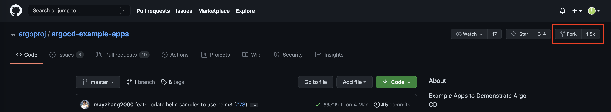
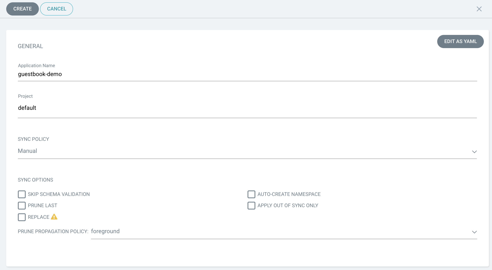
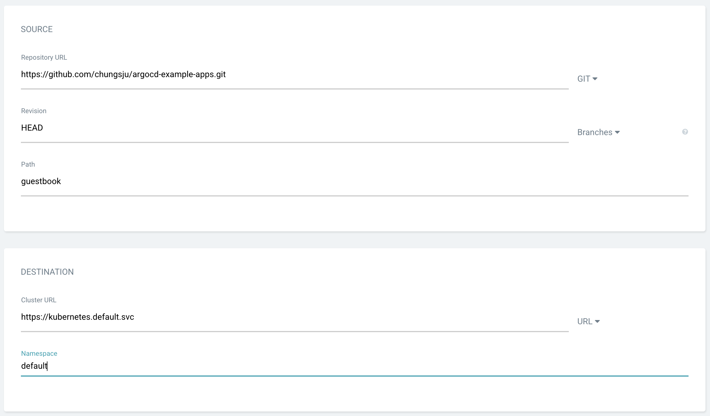
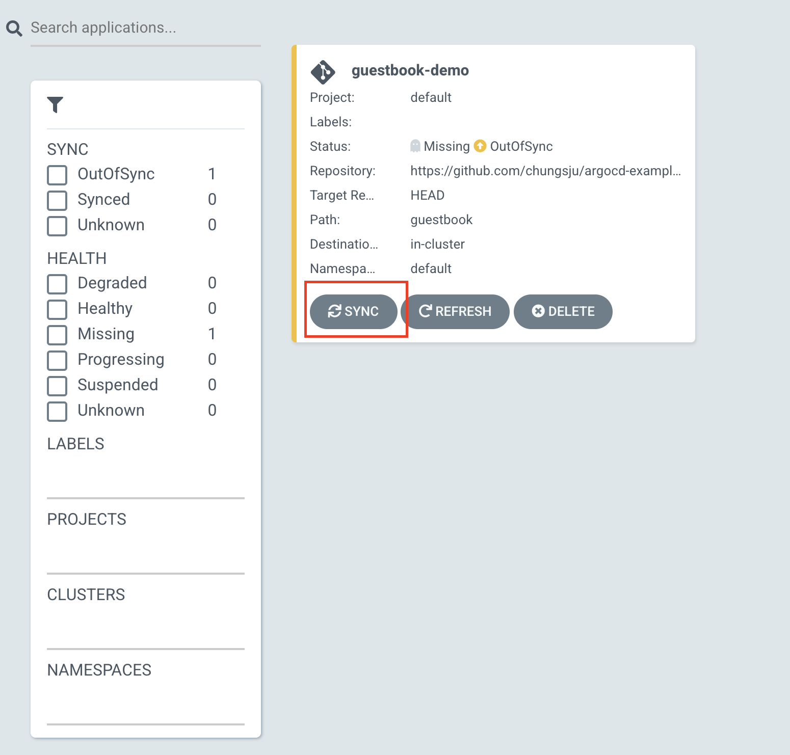
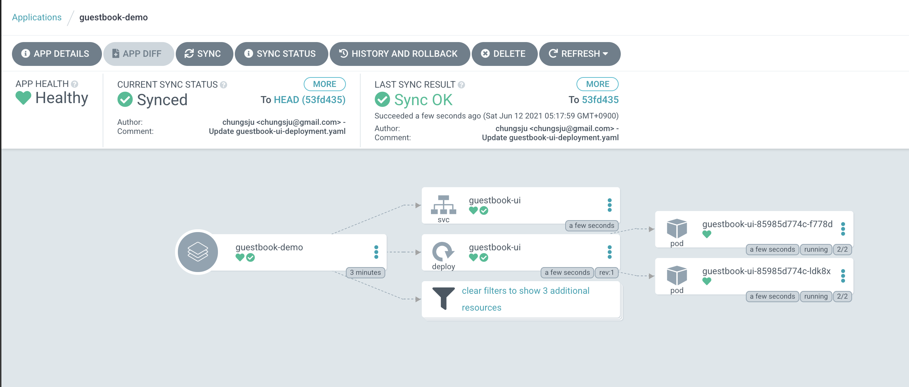
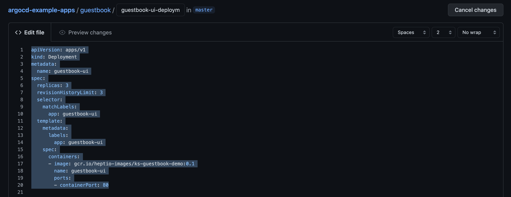
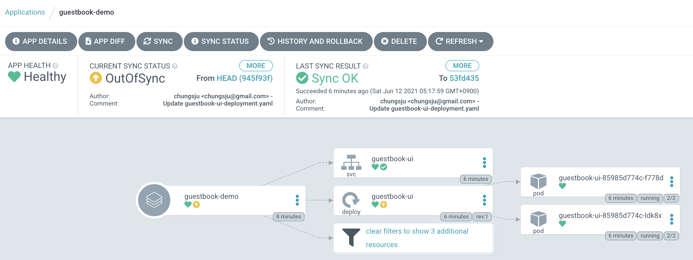
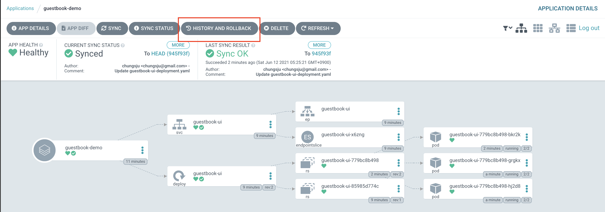
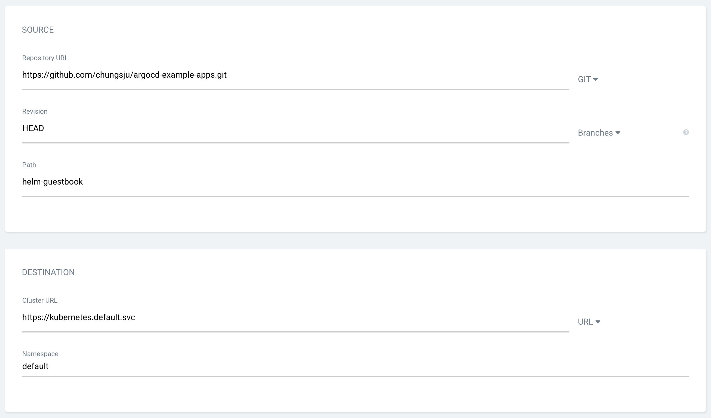
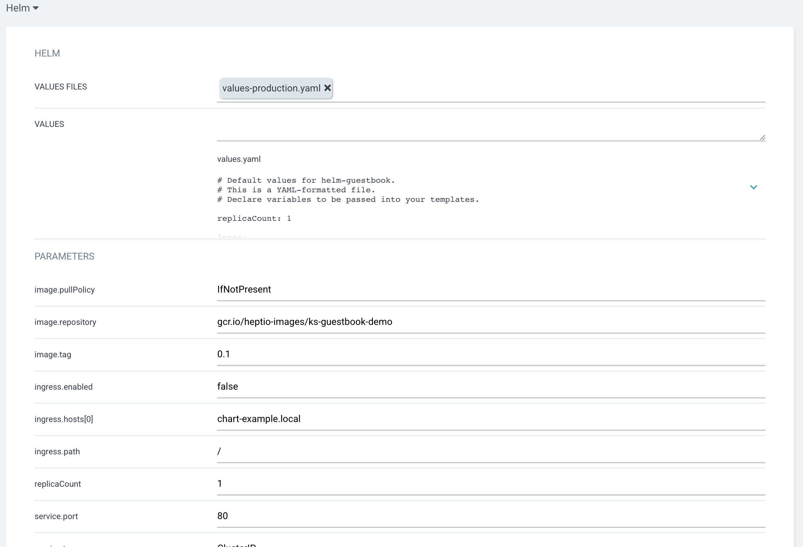

# Learning Kubernetes

[toc]

##  17. ArgoCD

### 17.1 ArgoCD 클러스터 설치


- argocd 설치

```{bash}
kubectl create namespace argocd
kubectl apply -n argocd -f https://raw.githubusercontent.com/argoproj/argo-cd/stable/manifests/install.yaml

kubectl patch svc argocd-server -n argocd -p '{"spec": {"type": "LoadBalancer"}}'
```

- 패스워드 알아내기

```{bash}
kubectl -n argocd get secret argocd-initial-admin-secret -o jsonpath="{.data.password}" | base64 -d
```
> 위의 모든 과정은 Heml Chart를 통해서도 설치 가능합니다.
> helm repo add argo https://argoproj.github.io/argo-helm
> helm install my-argo-cd argo/argo-cd --set server.service.type=LoadBalancer,configs.secret.argocdServerAdminPassword=mypassword

- 로드벨런서 주소 얻은 후 브라우저로 로그인
```{bash}
kubectl get svc argocd-server -n argocd
```

### 17.2 배포대상에 대한 Git 리포지토리 만들기

- Github에 로그인

- Argo CD를 연습하기 위한 샘플 Git 리포지토리 내 Git 리포지토리로 Fork

https://github.com/argoproj/argocd-example-apps



### 17.3 ArgoCD 와 Git 리포지토리 연동

- NEW APP 등록
  

- Git 소스와 배포 Destination 등록

  

### 17.4 SynC 하기





### 17.5 Github의 guestbook/guestbook-ui-deployment.yaml파일 수정 및 커핏

replicas : 3

image: gcr.io/heptio-images/ks-guestbook-demo:0.1 으로 수정




### 17.6 Sync 하기
- Git저장소 변경으로 인한 OutOfSync 상태

  

- Sync 하기

### 17.7 Rollback 하기



### 17.8 helm chart 등록




- 배포하고자 하는 helm value 파일 선택

